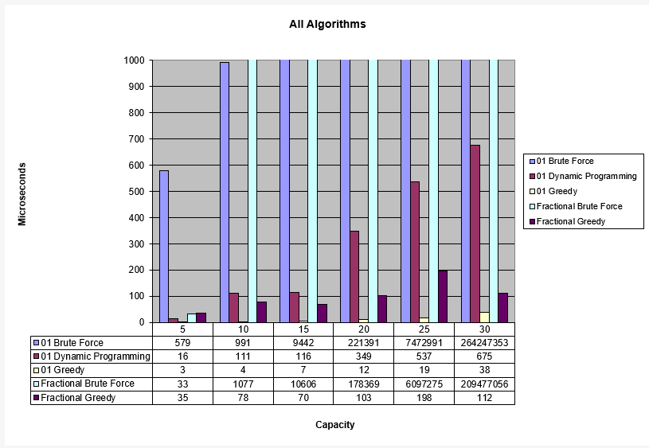

# Algorithm Implementation

## 01 Knapsack (Brute Force) - Mike
For this algorithm I started by looking around the internet for approaches to 01 knapsack problems in general. I remembered us covering 01 knapsack in class as part of the dynamic programming lecture but I didn't see the brute force approach demonstrated there. Luckily, there's a ton of information for 01 knapsack by academic and programming websites so I was able to get started on this pretty quickly. When looking around I saw the word 'permutation' come up pretty frequently and to my knowledge there's no easy built in permutation generator for java. Most of the online examples and papers I was reading used Python's itertools, which was like 1 line of permutation generation. For our project though, I decided I was going write permutation generation from scratch. The easiest way I could think of was a sequence of 1s and 0s representing both the index of an item and whether or not the item at that index was in the knapsack(1 = in 0 = not in). Our final implementation is EXTREMELY brute force because it's both very mechanical and not optimized at all. With each permutation we are filling an array with 1s and 0s based on a bitmasked number representing our current iteration and then going through that array a second time to pick our items. A much better optimization would be to just use the bitmasked value to put the item into the knapsack directly. We also do not do any validation on item permutations. If the knapsack is going to be overweight or low value we don't short circuit and move onto the next permutation. With all that in mind it shouldn't be surprising that the brute force approach is the slowest of the 3 approaches. The Big O time is probably somewhere at or slightly above 2^n where n is the number of items that are available. This is because the items can either be in or out of the bag and we cannot repeat an item. While searching around for other ways of doing this in Java I stumbled upon some recursive approaches resemble a divide and conquer algorithm. The authors of these approaches stated that this is still suboptimal because it floods memory with new arrays and variables and can get out of control if you have larger knapsack capacities. It was tempting to try this but closed form functions are just easier for me to understand.

## 01 Knapsack (Greedy) - Mike
This approach is pretty straight forward. I couldn't find many interesting or unique versions of this other than what we went discussed in class. The algorithm is very simple, we just sort the set of items by value and then begin taking the highest value items until we cannot fit anything else into the knapsack. For our implementation I basically copied and pasted the selection sort algorithm from the previous project. I suppose you could optimize this further by using a better sorting algorithm but the greedy approach isn't providing a complex solution to the knapsack problem and would probably be the fastest algorithm regardless. This is because the algorithm spends the majority of its time sorting the items to take and our items sets are always relatively small. 

## 01 Knapsack (Dynamic Programming) - Mike
Even though this is the most complex to understand it wasn't the hardest to implement. I was basically able to implement this almost step by step as demonstrated in the dynamic programming lecture. I actually implemented this earlier in the quarter for  CSB 305 assignment 2 because it was simpler than doing the math for each cell. When I looked around online though I found several interesting approaches including some recursive ones and a space optimized solution that skips making a 2D array entirely (below).

```
   int[] dp = new int[capacity + 1];
 
   for (int i = 1; i < totalValues + 1; i++) {

       for (int w = capacity; w >= 0; w--) {
 
            if (weights[i - 1] <= w)
 
               dp[w]= Math.max(dp[w], dp[w - weights[i - 1]] + values[i - 1]);
            }
        }
        
   return dp[W];
```
It's a little difficult for me to understand why this works though because I don't understand exactly what that inner Math.max comparison is looking for. I decided to keep our implementation more mechanical than the online examples because the construction of a table and the cell by cell comparisons more closely matches what we did in class/pen & paper solution. As you can see from our charts brute force and the DP solution are roughly the same until you go over 20 items. After that the difference in time spent between the two is so massive that the DP data doesn't even chart.

## Fractional Knapsack (BruteForce)
This naive approach takes factorial time compare with dynamic programming which in turns take linear time.  The brute force approach takes extraordinatory amount of time because it needs to process a list of permutations that is generated from input data.  It took me a while to read to realize that in order of process matters. 
```
For example, assume we have an input of 3 items and a weight limit of 6.

Item 1: 3 lb for total profit of 3

Item 2: 2 lb for total profit of 3

Item 3: 2 lb for total of profit of 5

If we add item 1, item 2 and item 3 to the knapsack in the row, maximum profit would be 3 + 3 + 5/2 = 8.5.

If we add item 1, item 3 then item 2 to the knapsack in that order, maximum profit would be 3 + 5 + 3/2 = 9.5.
```
In summary, in this case, the order (the premutations matter here). The process time would factorial of the length of the input, which would even longer than the processing time obtained here.

Unforunately this is a point that took me a while to realize while to trying to reconcile the different between the results obtain between this algorithm and that result obtained by using dynamic programming.  Because I mistakenly use combination rather permutations, the results is similiar but not exactly as one would with using dynamic programming.

## Fractional Knapsack (Greedy)
For this algorithm, I was able to make it myself without using resources that can guide me through it; I mainly approached it on how I would do the problem by hand, because of that this algorithm went through multiple changes and revisions. The biggest problem that occured while making it was figuring out how to sort the items based on the ratios as they were two different references in our program layout; I was able to resolve this problem by using a tree map, as storing the ratios as keys would always sort them and it can keep references to which pairs correspond to that ratio. Moving on, the expected runtime outcome of this algorithm met my expectations, with it being able to run much quicker than everyother algorithm except for the zero one greedy algorithm. Since the fractional knapsack need to calculate all the ratios and and items until the max weight it reach it is expected to take longer than the zero one algorithm as it's results are always simply taking the highest profits.

## Additional Notes - Mike
Joel found an interesting bug while working on the graph data for our project. Whenever we ran the project with the required csv files the algorithms would take noticeably longer time with the 5 item file for some reason. I took some time to look into it and thought maybe it was like Strassen's algorithm where changes in computer architecture were changing the expected results. I didn't see anything online and the weirdest part was that it was consistently the 5 item data set even with the faster greedy algorithms. I tested the files by switching out the data and renaming them and it was always the first data set to go in that was the slowest. I didn't find the actual cause of the issue but I was able to isolate it. In the project runner's inner for loop we start the timer, call the algorithm's solve function then stop the timer after it finishes. I found that if I made a redundant call to the algorithm's solve function before starting the timer it would 'warm up' the list of algorithms and give us the times we expect. I don't recall seeing this in the previous project but it would still be good to figure out why this is happening. 

